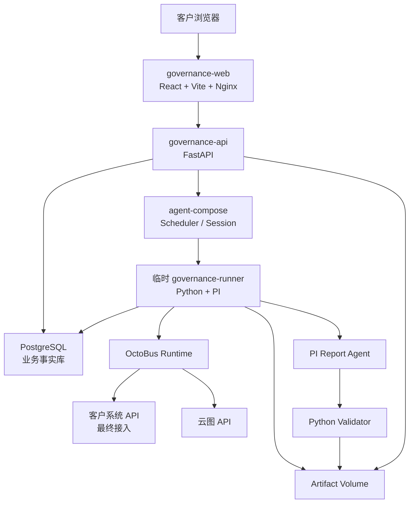
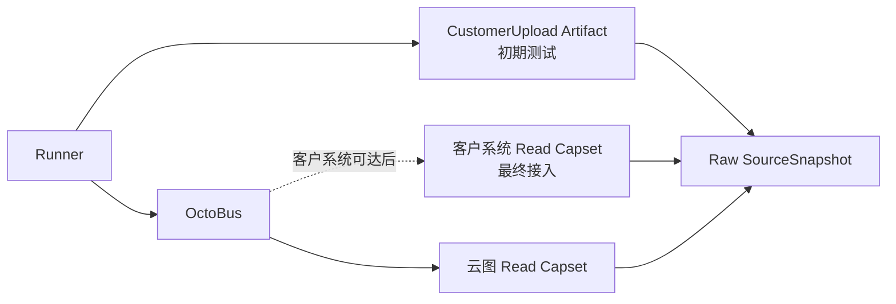
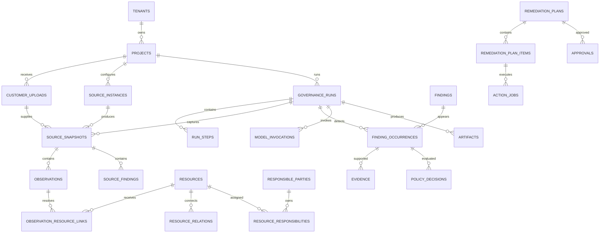

# 暴露面资产与风险治理平台：功能架构与数据流转架构 v0.1

状态：已确认的架构基线  
日期：2026-07-19  
适用范围：单客户、单实例、私有化部署的商业版第一期

## 1. 产品定位

商业版不是“让 Agent 自由读取文件并完成全部工作的 IP/端口对账工具”，而是：

> 面向多源资产数据的资产一致性治理与风险发现处置平台。

产品包含两条业务主线：

```text
资产治理：
多源事实 → 实体识别 → 属性/关系对比 → Finding → 确认与修正

风险治理：
云图风险判断 + 统一资产事实 → 风险归一/补充 → Finding
→ 审核 → 处置 → 复测 → 关闭
```

IP 和端口是第一批核心资产字段，但不是系统唯一的数据模型。首期同时支持 URL、域名、应用、部门和责任人，并允许通过受控 JSONB 字段扩展客户属性。

## 2. 已确认的关键决策

| 主题 | v0.1 决策 |
|---|---|
| 部署形态 | 单客户、单实例、Docker Compose 私有化部署 |
| 应用基座 | 固定 `full-stack-fastapi-template@4d3d5e9`，一次性引入并独立维护 |
| 调度与执行 | agent-compose 负责 Cron、手动/API 触发、Session 隔离与运行历史 |
| 业务事实 | PostgreSQL 是唯一权威结构化事实库 |
| 临时执行 | 每个 Governance Run 启动一个临时 Python Runner |
| 外部能力 | 最终交付中，客户系统和云图统一通过 OctoBus Service Package/Instance/Capset 接入 |
| 初期客户输入 | 客户系统不可达期间使用受控 CustomerUpload 完成测试；不把文件伪装成 OctoBus Instance |
| 数据语言 | Python 为 API、确定性处理和规则主语言；SQL/Polars 承担重计算 |
| 前端与 Agent | React/TypeScript；PI Agent Kit 使用 TypeScript |
| Agent 编排 | v0.1 使用单个受限 PI；pi-workflow 先做 PoC，不进入关键路径 |
| 大文件 | 本地持久化 Artifact Volume；PostgreSQL 只保存元数据、路径和 Hash |
| 消息与队列 | 不引入 Redis、Celery、Kafka、Temporal 和通用 Outbox |
| 规则扩展 | 普通 Python 函数；不建设 DSL、插件框架或可视化规则编辑器 |
| 监控 | 结构化日志、健康检查、业务状态页、审计表和可选 OpenMetrics |

应用基座只提供认证、用户、API/Web 工程骨架、OpenAPI 客户端和测试基础设施，不承担 Governance Run、治理数据模型、调度或外部系统接入。详细边界见
[ADR-0001](../adr/0001-use-full-stack-fastapi-template.md)。

## 3. 功能架构

```text
治理平台
├─ 项目与数据源
├─ Run 中心
├─ 统一资产视图
├─ Finding 治理中心
│  ├─ 资产类 Finding
│  └─ 风险类 Finding
├─ 报告中心
├─ 处置与审批
└─ 系统与审计
```

### 3.1 项目与数据源

- 管理项目及客户侧、暴露面侧输入；
- 初期上传并校验客户报备文件；
- 最终为客户系统和云图绑定 OctoBus Service、Instance 和只读 Capset；
- 测试连接并预览来源 Schema；
- 配置字段映射、启停状态和同步周期；
- 查看最近同步时间、记录数和错误摘要。

### 3.2 Run 中心

- 创建手动 Run；
- 查看定时 Run；
- 展示当前步骤、耗时和失败原因；
- 使用同一个业务 Run ID 恢复失败任务；
- 查看关联的 agent-compose Session；
- 下载本轮原始快照、报告和导出产物。

### 3.3 统一资产视图

- 查看 IP、Endpoint、Domain、URL、Application；
- 查看资产的来源观测；
- 查看资产间关系；
- 查看部门、责任人及责任关系；
- 对来源冲突和低置信度实体匹配进行人工确认。

### 3.4 Finding 治理中心

资产类首期覆盖：

```text
未报备资产
未观测资产
IP/端口差异
URL 差异
部门不一致
责任人不一致
责任人缺失
状态冲突
关系冲突
数据过期
```

风险类首期覆盖：

```text
云图高危端口
云图高危应用
云图管理后台
测试或默认页面暴露
违规公网暴露
```

风险详情必须同时展示：

- 云图原始判断；
- 治理系统归一结果；
- 严重性；
- 置信度；
- Evidence；
- 责任主体；
- 推荐动作；
- 当前处置状态。

### 3.5 报告中心

- 确定性统计；
- Agent 生成的客户说明；
- HTML、PDF 和 CSV 导出；
- 报告版本、输入快照、模型调用和 Artifact Hash 追溯；
- Agent 失败时提供确定性模板报告。

### 3.6 处置与审批

- 根据已确认 Finding 生成处置 Plan；
- 展示固定 `plan_hash`；
- 审批或拒绝；
- 通过 OctoBus Action Capset 执行；
- 查询外部任务状态；
- 复测并关闭 Finding。

### 3.7 系统与审计

- 管理用户和项目角色；
- 管理数据源和 Policy 版本；
- 查看操作审计；
- 查看系统健康和失败任务；
- 管理 Artifact 保留策略。

## 4. 总体运行架构



### 4.1 常驻服务

| 服务 | 技术 | 职责 |
|---|---|---|
| `governance-web` | React、TypeScript、Vite、Nginx | 客户界面和反向代理 |
| `governance-api` | Python、FastAPI、Pydantic | 项目、Run、资产、Finding、报告、审批 API |
| `postgres` | PostgreSQL | 业务状态、事实、治理结果、审计 |
| `octobus` | OctoBus Runtime | 外部系统能力网关 |
| `agent-compose` | agent-compose daemon | 定时、触发、隔离、Session 和运行日志 |

`governance-web` 和 `governance-api` 从固定版本的
[`full-stack-fastapi-template`](https://github.com/fastapi/full-stack-fastapi-template/tree/4d3d5e92c1ea6b3fa0fab02c41124844ec45bca8)
开始实现。模板的一次性导入、清理、认证、数据访问和 Nginx 边界统一以
[ADR-0001](../adr/0001-use-full-stack-fastapi-template.md) 为准，避免在架构文档重复维护清单。

### 4.2 临时 Runner

`governance-runner` 由 agent-compose 为每个业务 Run 创建，完成后退出。镜像包含：

```text
Python 业务代码
PostgreSQL Client
OctoBus Connect Client
Polars / PyArrow
PI Runtime
可选的 pi-workflow PoC
```

Runner 直接调用 OctoBus Connect HTTP 接口，不增加额外 Connector 代理服务。API 和 Runner 共享同一套 Python 领域代码与数据库访问代码。

### 4.3 组件边界

```text
agent-compose
  负责：什么时候运行、在哪里运行、运行日志和 Session 生命周期

PostgreSQL
  负责：业务执行到了什么状态、哪些事实和 Finding 已经成立

OctoBus
  负责：可以调用哪些外部系统能力

PI
  负责：基于受控 Evidence 生成结构化报告草稿
```

agent-compose 的 Run 成功不等于业务 Run 完成；客户业务状态始终以 PostgreSQL 为准。

## 5. 客户输入与最终 API 接入流程

客户系统不可达的初期测试阶段使用受控文件上传：

```text
客户报备文件
→ 类型、大小和结构校验
→ 计算内容 Hash 并保存不可变 Artifact
→ 形成 CustomerUpload
→ Operator 显式设为 Project 当前 CustomerUpload
```

CustomerUpload 只是过渡输入，不是 Source Instance，也不通过伪造 Instance、Credential 或 Capset 复用 OctoBus。上传不自动触发 GovernanceRun；原始文件由确定性代码校验和解析，PI 不读取完整客户文件。客户系统可达后，新 Run 改用客户 Source Instance，历史 CustomerUpload 和基于它完成的 Run 继续保留。

该路径只服务于客户系统尚未完成或不可达期间的短期初期测试，不建设长期通用导入平台。第三交付阶段只实现上传、确定性校验、不可变保存和 Run 选择所必需的最小能力，不增加上传预览、历史对比、生命周期状态、按 Project 保留策略、格式转换链路、数据清洗工作流或可视化 Profile 编辑器；完成下列最小契约后不再扩展文件上传能力。

只有通过全部拒绝级校验的文件才创建 CustomerUpload。校验失败时删除临时文件并返回脱敏稳定类别，不创建 CustomerUpload，也不为失败尝试增加 `PENDING`、`REJECTED` 状态或独立 UploadAttempt 业务表；失败尝试只进入不含文件名、单元格内容和解析器原文的安全操作日志。

任何参与资产匹配的核心字段无效时拒绝整份文件，不静默丢弃单行，也不创建部分有效的 CustomerUpload。初期核心字段包括资产 IP、起始端口与结束端口、Web 标识，以及 Web 标识为“是”时的 URL；部门、负责人、服务类型等责任描述字段缺失时接受文件并记录 warning，避免因非匹配字段不完整阻断对账。

`资产IP` 去除首尾空格后必须是单个合法 IPv4 或 IPv6 字面值，私网地址允许。CIDR、IP 范围、逗号分隔列表、主机名、公式及其他表示均为拒绝级错误；服务端不自动拆分网段或执行 DNS 解析。

`是否web界面` 去除首尾空格后接受 `是`、`否` 或 `无`；`无` 只是 `否` 的输入别名，不形成第三种业务状态。值为 `是` 时，`web界面url` 必须是单个非空文本，但可以不带 `http://` 或 `https://`；值为 `否` 或 `无` 时 URL 必须为空，否则整份拒绝。上传阶段不请求 URL，不做严格 URL 解析，也不强制它与本行资产 IP 或端口一致；原值保留在 Artifact，规范化留到后续 Observation。

CustomerUpload 的数据行粒度是一个 IP 的一个端口。同一 IP 可以因开放多个端口出现多行，这些行不是重复资产；部门、负责人等责任字段在这些行中重复属于正常输入。为兼容现有表头，起始端口与结束端口继续同时存在，但两者必须相等；不相等表示端口范围，第三交付阶段拒绝整份文件而不展开范围。

起始端口和结束端口必须分别表示 `1–65535` 的整数并且相等。接受 Excel 整数数值单元格或去除首尾空格后的纯十进制数字文本；`0`、负数、小数、公式、范围文本、十六进制及其他表示均为拒绝级错误，任一行不合法都拒绝整份文件。

上传阶段不按 IP 或 IP + 端口合并，也不执行行级去重。所有通过校验的数据行及其顺序都原样保存在不可变 XLSX Artifact 中，完全相同的重复行也不改写；SourceSnapshot 只记录来源批次、Artifact 引用、内容 Hash、Profile/Schema 版本和记录数。逐行结构化及来源行号属于后续 Observation，资产归并、冲突判断和去重属于再后的 Resource Resolution，均不进入第三交付阶段。当前阶段只做整份文件级幂等。

不同客户文件的表头差异最终通过不可变、版本化的 CustomerUploadProfile 适配。每个 Profile 只归属于一个 Project，各 Project 独立维护版本链，不建设跨 Project 共享 Profile 库；新 Project 根据系统内置默认结构形成自己的 v1。当前第三交付阶段只使用并展示默认 v1，Project 的当前 Profile 指针初始化为该版本；已接受的 CustomerUpload 固定 Profile ID 与版本。只有真实客户表头证明默认 v1 不足时，才另行交付新版本创建与切换，且该可选能力不阻塞默认 v1 的 Run 主链路。

整份文件级幂等键是 Project ID、上传原始字节 SHA-256、Profile ID 与 Profile 版本的组合。相同组合再次上传时返回既有 CustomerUpload 及其 Artifact；不同 Profile 版本下的相同字节形成新的 CustomerUpload 和新的 1:1 Artifact，因为校验契约已经变化。本阶段不建设跨上传内容寻址或共享 Artifact。

每个 Project 只保存一个当前选定 CustomerUpload 指针。上传成功只进入可选列表，不自动改变该指针；Operator 必须显式选择且动作必须审计。定时、手动和 API Trigger 都统一使用当前指针，不允许按单次 Trigger 临时覆盖；未选择时启动前拒绝且不创建 GovernanceRun。Run 创建后固定当时的 CustomerUpload，后续切换只影响未来 Run。

为清理误上传的敏感文件，只有 Admin 可以删除当前未被选中、且从未被 GovernanceRun 或 SourceSnapshot 引用的 CustomerUpload；删除业务记录和 Artifact，并保留不含文件内容的 AuditEvent。当前选中或已经被引用的 CustomerUpload 不提供手工删除能力，后续只受统一 Artifact 保留策略约束。

未来确有真实客户表头差异时，CustomerUploadProfile 的可配置面最多包含列名映射、别名、必填或可选，以及缺失时的拒绝或 warning 分类。IP、端口、Web 标识、URL 等字段的值语义与核心字段不可降级约束仍由确定性 Python 代码负责；当前默认 v1 校验器不接受 Profile JSON 或可选 Schema 参数，初期不提供任意表达式、可视化规则编辑器或通用规则 DSL。

系统在创建 Project 时自动形成 Project 专属的默认 CustomerUploadProfile v1，并把不可变定义快照保存到 PostgreSQL；已有 Project 通过迁移补齐。第三交付阶段当前只提供当前 Profile 的只读结构摘要，不实现 Profile 创建、切换或编辑 UI。真实客户表头需要适配时，再由独立、非阻塞票决定 Admin 的窄 JSON API，不提前建设通用 validator。

默认 Profile v1 的必需表头是 `资产IP`、`起始端口`、`结束端口`、`是否web界面` 和 `web界面url`；`web界面url` 表头始终存在，但行值只在 Web 标识为“是”时必填。表头必须精确匹配，不做首尾空格、大小写、全半角或近似归一；显式别名留给未来 Profile 版本。`服务类型`、`资产负责人`、`资产所属部门`、`端口负责人` 和 `部门` 是可选责任信息，缺失只产生 warning；`序号` 可有可无，只作为来源字段保留，不参与校验和匹配。默认 v1 不要求其他列。

Profile 未定义的额外列不导致拒绝，原样留在不可变 XLSX Artifact 中，但第三交付阶段不解析、不匹配，也不写入结构化事实。上传结果只返回 `extra_columns_ignored` warning 和额外列数量，不回显列名或内容；需要使用这些列时再通过新的 Profile 版本显式映射。

接受时产生的 warning 只作为 CustomerUpload 上的不可变汇总保存，包含稳定 code、规范字段标识和数量。五个责任字段按受影响的数据行计数：整列缺失时数量等于非空数据行数，表头存在时数量等于该列空值行数；`序号` 缺失或为空不产生 warning；`extra_columns_ignored` 是唯一按额外列数量计数的 warning。不创建逐行 warning 表，不保存单元格内容、原始列名或行号，也不增加 `ACCEPTED_WITH_WARNINGS` 状态。页面只展示汇总，详细来源仍是原始 Artifact。

第三交付阶段只接收 `.xlsx` CustomerUpload，并同时校验文件扩展名与实际 ZIP/OOXML 结构；`.xls`、`.csv`、`.xlsm` 或扩展名与内容不一致的文件直接拒绝，不在服务端自动转换格式。

XLSX 只作为静态数据载体。任意列出现公式，或工作簿包含外部链接、数据连接、嵌入对象、OLE 或控件时整份拒绝；服务端不执行公式，也不读取公式缓存结果。普通样式和静态图片可以保留在原始 Artifact 中，但不解析、不参与校验或后续结构化结果。

工作簿必须只包含一个可见工作表，不允许额外的可见、隐藏或 `veryHidden` 工作表；否则整份拒绝。服务端不自动选择第一个工作表，也不增加工作表名称配置。

第一行固定为唯一表头，第二行开始为数据；不支持标题行、说明行、多行表头或合并表头。表头为空、重复，或多个列映射到同一规范字段时整份拒绝，不自动猜测表头位置。

表头后必须至少有一条非空数据行，否则整份拒绝。完全空白的行直接忽略且不产生 warning，SourceSnapshot 记录数只统计非空行；只要一行中有任意内容，就必须作为数据行完成全部拒绝级校验，不能因核心字段缺失而被当作空行跳过。原始 XLSX Artifact 不因这些判断被改写。

CustomerUpload 实际接收内容统一限制为 20 MiB（20 × 1024 × 1024 字节），不按 Project 配置不同上限，也不只信任客户端声明的 `Content-Length`。服务端流式计数，超限后立即停止、删除临时文件并返回稳定脱敏错误，不创建 CustomerUpload。

每个 CustomerUpload 独占一个 Artifact，Artifact 存储键只使用服务端生成的 UUID，原始文件名不得进入存储路径或临时路径。原始文件名最多作为 CustomerUpload 的受保护展示元数据保存，只接受不含路径与控制字符、长度不超过 128 个字符的 `.xlsx` basename；不合法时返回 `invalid_filename`。文件名不得进入日志或错误响应。

由于 XLSX 是 ZIP 容器，20 MiB 请求上限不能单独约束解压后的 CPU、内存和磁盘占用。实现验收前必须使用最终确定性 parser 对正常边界样例做最小资源基准，据此在代码和测试中固定全局 ZIP 条目数、单条目解压量和总解压量上限，不按 Project 配置。解析前先检查 ZIP 目录并使用受限读取；正常边界 fixture 必须通过，压缩炸弹 fixture 必须以 `workbook_resource_limit` 拒绝、删除临时文件且不创建 CustomerUpload。

拒绝级校验发现第一个错误后即停止，只向已授权 Operator 返回稳定 code、公开说明，以及适用时的首个工作表行号和规范字段标识。响应、业务审计和操作日志都不得包含原始单元格值、客户 IP、URL、文件名、原始列名、解析器异常或临时路径。

| HTTP | 稳定类别 |
|---:|---|
| 400 | `invalid_filename`、`incomplete_upload` |
| 413 | `upload_too_large`、`workbook_resource_limit` |
| 415 | `unsupported_workbook_type` |
| 422 | `malformed_workbook`、`unsupported_workbook_feature`、`missing_required_structure`、`invalid_required_value` |
| 500 | `upload_storage_failed` |

认证、Project 授权、归档和资源存在性错误复用控制面既有的 401、403、404 和 409 契约，不为上传端点重写认证依赖或增加第二套授权错误码。

最终交付仍以客户系统 API 经 OctoBus 接入为目标。客户提供 API 文档后，不让 Agent 在生产运行时临时理解文档并直接调用接口。

```text
客户 API 文档
→ 集成工程师分析认证、分页、限流和字段
→ 开发或复用 OctoBus Service Package
→ 契约测试
→ 导入 OctoBus
→ 创建客户 Instance
→ 配置 Credential
→ 分配只读 Capset
→ 试拉取
→ 字段映射验收
→ 正式启用
```

对象关系：

```text
Service Package
  某一类系统的 API 对接实现，可复用

Instance
  某个客户环境的 URL、配置和凭据

Capset
  本平台获准使用的能力集合

Source Instance
  业务数据库中对 OctoBus Instance 的引用

Customer Upload
  客户系统不可达期间的不可变客户侧文件输入
```

Source Instance 的“连接有效”只表示当前 Instance 绑定和连接配置已经成功通过读取验证。Instance 绑定、地址、凭据或 Capset 变化后必须重新验证；配置不变时不设置按时间自动失效的 TTL，实际 Run 中的拉取失败按 `FAILED_DATA` 处理。

OctoBus 当前提供 Instance 的 `ConfigSHA256` 和 `SecretSHA256`，可作为连接配置指纹的一部分，但二者不能单独证明 Capset 授权和实际读取方法可用。连接验证仍须通过对应 Service Package 的最小只读方法完成。初期先验证云图读取、Capset 与方法选择的稳定版本指纹和脱敏结果；客户系统侧的同类契约在其可达后验证，不以 CustomerUpload 结果冒充。

第三交付阶段只把 #29 已验证的 `cloudatlas-read` 提升为产品拥有的 OctoBus Service Package，唯一暴露方法是 `cloudatlas.read.v1.CloudAtlasReadService/ListIPAssets`。正式包固定 Package 与 Descriptor 内容 Hash，Capset 只绑定当前 CloudAtlas Instance 和该方法；不增加其他读取方法、Action 方法或通用 CloudAtlas Connector。

CI 使用 #29 的确定性上游 fixture 验证该精确调用链、失败分类和指纹失效。真实 CloudAtlas 环境的单方法只读 canary 是部署前门槛；canary 通过前不得把 fixture 结果表述为真实授权、网络或生产数据契约已经验收。

同一 Project 对每类外部系统最多启用一个 Source Instance，可以保留已停用的历史引用。初期只有一个云图 Source Instance，并可保留多个不可变 CustomerUpload 版本；每个 GovernanceRun 只固定其中一个。客户系统可达后再启用一个客户 Source Instance。启用同类新外部来源前必须停用旧来源；同侧多来源所需的优先级、冲突合并、部分失败和步骤扇出语义不进入 v0.1。

Agent 可以协助生成 Service Package 草稿，但草稿必须经过代码审查、契约测试和人工启用。

第三交付阶段的管理页面只包含：Project 输入页的 CustomerUpload 上传、列表、选择和 warning 汇总；CloudAtlas 来源页的 Instance 绑定、验证状态、指纹及 Admin 配置、验证、启停操作；Run 页的 Trigger、Retry/Rerun、三步状态、固定输入和两个 SourceSnapshot 的 Hash 与记录数。该阶段不提供资产明细、比对结果、Finding、报告或原始数据预览；依赖项 10 的客户 Web 是后续包含资产和 Finding 的完整页面，不由此处提前实现。

## 6. 端到端数据流

### 6.1 Run 触发

```text
Cron / 手动 / API
→ agent-compose Scheduler
→ 创建 Governance Runner Session
→ Runner 创建或恢复 governance_run
```

触发输入至少包含：

```json
{
  "project_id": "project_bj_mobile",
  "trigger_id": "daily_20260720",
  "trigger_type": "schedule",
  "requested_by": "system"
}
```

`project_id + trigger_id` 用于防止同一次计划重复创建业务 Run。

`trigger_id` 是唯一规范名称，不再使用 `trigger_key`。定时触发沿用 agent-compose 对该次计划执行生成的稳定标识；手动或 API 触发必须由调用方通过 `Idempotency-Key` 提供，前端负责自动生成并在 HTTP 重试时复用。缺少幂等标识的手动或 API 触发直接拒绝，不由服务端静默生成；`Run Rerun` 必须使用新值。

`GovernanceRun` 不表示排队中的触发请求。只有 Runner 真正开始执行后，才按 `project_id + trigger_id` 原子地创建或恢复业务 Run；Runner 启动前的失败不创建空 Run，由 agent-compose 的触发或 Session 历史以及必要的 `AuditEvent` 记录。

Runner 在创建或恢复 `GovernanceRun` 前检查 Project 的来源前置条件。初期测试要求一个当前选定且已通过校验的 CustomerUpload，以及唯一一个启用且连接有效的云图 Source Instance；客户系统可达后，客户 Source Instance 替代 CustomerUpload。缺少任一输入、文件未通过校验、外部来源未启用或连接尚未验证时，启动前拒绝且不创建业务 Run；输入就绪后开始执行、但实际读取失败时，才创建并保留 `FAILED_DATA` Run。

创建 `GovernanceRun` 时，初期固定 CustomerUpload ID 与内容 Hash、云图 Source Instance 的已验证连接配置版本，以及实际 Runner 镜像摘要或构建版本；最终固定客户系统与云图两侧 Source Instance。Retry 始终复用原 CustomerUpload，选择不同上传版本必须创建新 Run。网络抖动、限流等配置与处理版本均未变化的失败可以 Retry；任一已固定的 Instance 绑定、地址、凭据、Capset 或 Runner 版本变化后，旧 Run 不再可恢复，必须通过 `Run Rerun` 创建新 Run。规范化规则、字段映射或 Policy 功能实际引入后再固定其版本，不为尚不存在的模块预建空字段。

同一 Project 同时最多执行一个 GovernanceRun。相同 `trigger_id` 进入恢复逻辑；不同 `trigger_id` 在已有执行中 Run 时启动前拒绝且不创建空 Run，不同 Project 可以并行。失败 Run 停止后，普通不同 `trigger_id` 也不得直接开启新一轮；新一轮必须由 Operator 显式执行 `Run Rerun`，使用新的 `trigger_id`、GovernanceRun 和 Session。该边界必须由 PostgreSQL 事务或约束兜底，不能只依赖 agent-compose 的调度行为。

有执行中 GovernanceRun 时，归档 Project 必须返回冲突，不自动停止 Session，也不增加 `CANCELLED` 状态。Run 停止后才能归档；Archived Project 不接受 Trigger、Retry、Rerun、新 CustomerUpload、CustomerUpload 选择或 Source Instance 变更，重新启用后才恢复这些操作。归档与重新启用不改变既有 Run；重新启用后，只要输入版本、来源配置、处理版本、原 Session、最新 Run 等既定条件仍全部成立，最新失败 Run 仍可 Retry。

### 6.2 数据拉取



要求：

- API 来源使用分页和游标，文件上传采用流式保存；
- 每页原始响应或上传文件立即写入 Artifact；
- 客户侧 SourceSnapshot 直接引用既有不可变 CustomerUpload Artifact，不复制上传文件；云图侧为本轮拉取写入独立原始 Artifact；
- 记录 Schema 版本、记录数、游标和 SHA-256；
- 不把完整 API 响应一次性放入内存；
- 原始快照创建后不可覆盖。

### 6.3 三层事实

```text
Raw SourceSnapshot
→ Source Observation
→ Canonical Resource View
```

1. `SourceSnapshot` 保存来源批次和原始 Artifact；
2. `Observation` 保存规范化但仍带来源的事实；
3. `Resource` 保存经过实体识别后的统一资产视图。

不同来源的字段不能直接相互覆盖。例如客户系统和云图责任人不一致时，两条 Observation 都必须保留。

### 6.4 资产与责任主体

技术资产和责任主体分开：

```text
Technical Resource
  IP / Endpoint / Domain / URL / Application

Responsible Party
  Department / Person

Resource Responsibility
  owned_by / managed_by / operated_by
```

资源之间通过关系连接：

```text
Domain resolves_to IP
URL hosted_on Endpoint
URL belongs_to Application
Application exposed_by URL
```

### 6.5 Finding 生成

确定性处理只需要三个普通步骤：

```text
数据清洗
→ 判断是否为同一个资产
→ 执行资产检查与风险检查
```

建议代码组织：

```text
domain/
├─ normalization.py
├─ resolution.py
├─ asset_checks.py
├─ risk_checks.py
└─ findings.py

policies/
└─ dangerous_ports.json
```

不建设通用规则引擎、DSL、插件加载系统或可视化规则编辑器。

### 6.6 云图风险归一

云图已经具备高危端口、高危应用和管理后台等风险判断能力。系统必须保留原始来源判断：

```text
CloudAtlas SourceFinding
→ 风险归一与责任补充
→ Governance Finding
```

治理系统可以：

- 统一 Finding 类型；
- 关联 Canonical Resource；
- 补充责任部门和责任人；
- 结合 Policy 产生推荐动作；
- 根据额外证据调整治理置信度。

治理系统不能覆盖或删除云图原始判断。

### 6.7 报告生成

```text
Finding / Evidence
→ 有界 EvidenceBundle
→ PI StructuredReport Draft
→ Python Validator
→ Renderer
→ HTML / PDF / CSV
```

Agent 不读取全量 CSV、Parquet 或数据库，只通过受控工具查询有界数据。

### 6.8 处置

治理 Run 与处置 Run 分成不同 agent-compose Session：

```text
Governance Session 完成
→ 人工审核
→ 创建 RemediationPlan
→ 审批固定 plan_hash
→ 新建 Action Session
→ OctoBus Apply
→ 查询状态
→ 复测
→ 关闭或重新打开 Finding
```

等待人工审批时不保持 Runner Session 空转。

## 7. 业务 Run 与失败恢复

### 7.1 Session 粒度

```text
一个 Governance Run
= 一个 agent-compose Governance Session

一个已批准的处置计划
= 一个独立 agent-compose Action Session
```

不为每个小步骤创建单独 Session。

该对应关系在 Retry 中保持不变：`Run Retry` 必须通过 `ResumeSession` 恢复原 `session_id`。原 Session 丢失或损坏到无法恢复时，Retry 失败；Operator 只能显式发起 `Run Rerun`，创建新的 GovernanceRun 和 Session，不为同一 Run 静默创建替代 Session。

Runner 失联或经过一段时间本身不能释放 Project 的执行资格。只有确认关联的 agent-compose Session 已进入终态后，才能把仍处于执行中的业务 Run 收敛为 `FAILED_PROCESSING` 并允许后续恢复；无法获得可靠终态信号时必须 fail-closed，不使用任意超时推断 Session 已死亡。

### 7.2 Run 步骤

第三交付阶段只实际创建三个步骤：

```text
LOAD_CUSTOMER
→ PULL_CLOUDATLAS
→ PUBLISH
```

`PUBLISH` 必须同时看到客户侧和云图侧两个不可变 SourceSnapshot。任一读取失败时 Run 进入 `FAILED_DATA` 且不发布，已经成功写入的 Snapshot 与 Artifact 保留在该失败 Run 中供 Retry 复用，但不进入默认客户视图。

`PUBLISH` 是真实的最终步骤，不使用重复顶层状态的 `COMPLETE` 步骤。第三交付阶段只会在一个事务中把 GovernanceRun 写为 `COMPLETED` 并更新 `projects.latest_completed_run_id`；CustomerUpload warning 仍属于上传，不产生 `COMPLETED_WITH_WARNINGS`。任一发布写入失败时整个事务回滚，随后把本轮收敛为 `FAILED_PROCESSING`；Retry 只重试失败的 `PUBLISH`，不重复输入未变化且已经成功的步骤。

`NORMALIZE`、`RESOLVE`、`CHECK_FINDINGS`、`BUILD_REPORT` 和 `VALIDATE_REPORT` 只在对应后续交付阶段实现时才加入，不为尚不存在的步骤预建记录。

每个 `run_step` 保存：

- 状态；
- 尝试次数；
- `input_hash`；
- `output_hash`；
- 开始和完成时间；
- 错误摘要。

`run_step` 在对应步骤第一次真正开始时才创建，不为尚未执行的未来步骤预建 `PENDING` 记录。它的状态只有 `RUNNING`、`SUCCEEDED` 和 `FAILED`；没有记录表示尚未开始。步骤顺序由 Runner 代码定义，不由数据库空行表达。

`Run Retry` 使用相同的 `trigger_id`、`governance_run_id` 和 agent-compose `session_id`，在对应 `run_step` 上增加尝试，并跳过输入未变化且已经成功的步骤。成功完成的 Run 不再 Retry；失败 Run 停止执行后，只有 Project 中不存在更新 Run、原 Session 可恢复，且该 Run 固定的 CustomerUpload 或客户 Source Instance、暴露面来源绑定、已验证连接配置与实际参与计算的版本均未变化时才能 Retry。普通不同 `trigger_id` 不会因为失败 Run 停止而直接创建新 Run；用户必须明确选择 `Run Rerun`，使用新的 `trigger_id` 创建新的 GovernanceRun 和 Session。新 Run 一旦创建，旧 Run 永久保留为历史记录且不能再次恢复，不需要额外的 `SUPERSEDED` 状态。

`GovernanceRun.status` 在 v0.1 只有以下五个值：

| 状态 | 含义 |
|---|---|
| `RUNNING` | Runner 已创建或恢复 Run，正在执行 |
| `FAILED_DATA` | 来源拉取失败，已停止且可能 Retry |
| `FAILED_PROCESSING` | 确定性处理失败，或已确认关联 Session 异常终止；已停止且可能 Retry |
| `COMPLETED` | 所有必需步骤成功，结果可发布且不可 Retry |
| `COMPLETED_WITH_WARNINGS` | 确定性结果完成，但报告生成降级；结果可发布且不可 Retry |

Retry 直接把失败 Run 转回 `RUNNING` 并增加步骤尝试，不增加 `RETRYING`。`PENDING`、`QUEUED`、`CANCELLED`、`PAUSED` 和 `SUPERSEDED` 不进入 v0.1。

### 7.3 发布规则

项目保存：

```text
projects.latest_completed_run_id
```

Runner 可以分步骤写入本轮数据，但客户默认页面只读取最新完整 Run。`PUBLISH` 在同一事务中写入 Run 完成状态并更新该指针；不能出现 Run 已完成但 Project 指针未更新，或指针指向未完成 Run 的部分发布状态。

### 7.4 失败分类

| 失败位置 | 结果 |
|---|---|
| CustomerUpload 缺失或未通过校验，或外部来源未配置、未启用、连接尚未验证 | 启动前拒绝，不创建业务 Run |
| CustomerUpload 读取/解析、客户 API 或云图拉取 | `FAILED_DATA`，不发布本轮 |
| 标准化、匹配或 Finding 检查 | `FAILED_PROCESSING`，不发布本轮 |
| Runner 失联且已确认关联 Session 终止 | `FAILED_PROCESSING`，允许按原 Run Retry |
| PI 或 pi-workflow | 生成模板报告，`COMPLETED_WITH_WARNINGS` |
| OctoBus 处置 | 只影响 `ActionJob`，不修改事实 Run |

## 8. PostgreSQL 数据模型

所有业务表默认包含：

```text
id UUID
tenant_id UUID
created_at TIMESTAMPTZ
updated_at TIMESTAMPTZ
```

v0.1 单实例单租户，但保留 `tenant_id`。

### 8.1 核心 ER



### 8.2 表分组

```text
项目与运行
├─ tenants
├─ projects
├─ customer_uploads
├─ source_instances
├─ governance_runs
└─ run_steps

来源事实
├─ source_snapshots
├─ observations
└─ source_findings

统一资产
├─ resources
├─ observation_resource_links
├─ resource_relations
├─ responsible_parties
└─ resource_responsibilities

治理结果
├─ findings
├─ finding_occurrences
├─ evidence
└─ policy_decisions

Agent 与产物
├─ model_invocations
└─ artifacts

处置
├─ remediation_plans
├─ remediation_plan_items
├─ approvals
└─ action_jobs

审计
└─ audit_events
```

### 8.3 Finding 生命周期

`Finding` 和 `FindingOccurrence` 分开：

```text
Finding
  跨 Run 持续存在的治理问题

FindingOccurrence
  某次 Run 再次发现该问题
```

`findings` 使用稳定 `dedupe_key`，保存首次发现、最后发现和当前状态；每次运行写入对应的 `finding_occurrence`。

### 8.4 核心唯一约束

```text
UNIQUE(project_id, trigger_id)
UNIQUE(run_id, step_code)
同一 project_id 最多一个执行中的 governance_run
governance_runs.status 只允许 v0.1 的五个状态
run_steps.status 只允许 RUNNING、SUCCEEDED、FAILED
同一 project_id + source_type 最多一个启用的 source_instance
UNIQUE(snapshot_id, source_record_key)
UNIQUE(project_id, resource_type, canonical_key)
UNIQUE(project_id, dedupe_key)
UNIQUE(finding_id, run_id)
UNIQUE(action_jobs.idempotency_key)
```

IP 字段原则上使用 PostgreSQL `inet`。v0.1 的 `AuditEvent.ip_address` 是显式例外：按 [#26](https://github.com/Notyet1307/Exposure-Agent/issues/26) 保留 `varchar(45)`。当前受支持的 HTTP 审计写入仅持久化经共享请求地址解析器验证的单个 IPv4 或 IPv6 地址；可信入口按部署边界提供 `X-Real-IP`，解析器不解析或保存原始 `X-Forwarded-For` 代理链。只有在出现绕过应用解析器的受支持写入方、已持久化异常数据、数据库级 IP/网段查询或索引需求，或客户/安全基线明确要求原生网络类型且生产及备份数据盘点条件已经具备时，才重新评估 `inet` 迁移。高频且需要索引的其他字段使用类型化列，客户扩展字段使用受 Schema 管理的 JSONB。

## 9. Agent 架构

### 9.1 定位

PI 是“基于确定性 Evidence 生成客户可读报告的编译器”，不是资产匹配引擎、风险扫描器或处置执行器。

### 9.2 v0.1 工具

```text
get_run_summary(run_id)

list_findings(
  run_id,
  domain,
  finding_type,
  severity,
  confidence,
  cursor,
  limit <= 50
)

get_finding(finding_id)

submit_report_draft(run_id, structured_report)
```

`get_finding` 返回已经确定的资源、来源判断、严重性、置信度、Evidence、PolicyDecision 和推荐动作。

### 9.3 Agent 权限

Agent 不拥有：

- PostgreSQL 凭据；
- 完整业务文件读取；
- OctoBus Capset；
- Finding 修改能力；
- 处置能力；
- 自由 Shell。

Runner 启动 PI 子进程时必须过滤环境变量，不把数据库连接串、OctoBus Credential 或 Action Capset 传给 PI。Agent 工具通过 Run 级只读 Token 查询有界 Evidence API；该 Token 在 Session 结束后失效。

### 9.4 输出与校验

模型先输出结构化 Draft。Validator 至少检查：

- Finding ID 和 Evidence ID 是否存在；
- 数字与确定性统计是否一致；
- 严重性、置信度和推荐动作是否被改变；
- 是否把“本轮未观测”写成“已经关闭”；
- 是否出现无 Evidence 的新风险判断。

失败时最多进行一次结构化修复，仍失败则使用模板报告。

### 9.5 pi-workflow

`pi-workflow` 可以作为 PI 内部：

```text
Evidence → 分析 → 独立验证 → Structured Report
```

的工作流引擎，但 v0.1 先运行单 PI 基线。只有兼容性 PoC 和 Golden Dataset 证明多阶段工作流显著改善 32B 模型质量后，才加入正式路径。

`pi-workflow` 的本地 Run 不替代业务 Run。

## 10. 技术栈

### 10.1 Python

```text
FastAPI       API
Pydantic      契约和校验
SQLAlchemy    数据访问
Alembic       数据库迁移
psycopg       PostgreSQL Driver
Polars        批量数据处理
PyArrow       Arrow / Parquet
pytest        测试
```

### 10.2 TypeScript

```text
React + Vite             客户 Web
PI Agent Kit             Agent 工具和 Prompt
pi-workflow JSON/TS      可选 Agent 工作流
OctoBus Service Package  外部能力定义
```

### 10.3 语言边界

- 资产和风险确定性逻辑使用 Python；
- 集合查询、聚合和约束优先使用 SQL；
- 大批量内存计算使用 Polars/Arrow；
- Shell 只负责构建、启动和部署，不承载业务规则；
- 不在 v0.1 引入 Go、Java 或 Rust 服务。

模板现有认证和用户模型使用 SQLModel。首期保留这套实现，并与现有 SQLAlchemy Engine、Session、Metadata 和 Alembic 环境共同管理；只有实际业务模型遇到可复现的 SQLModel 限制时，才另立 ADR 评估迁移。

出现经过测量的热点后，先优化 SQL、索引、批处理和 Polars，再决定是否重写局部组件。

## 11. 大数据量设计

### 11.1 数据处理

```text
OctoBus 分页结果
→ 每页立即写入 Artifact
→ 分批标准化
→ PostgreSQL COPY 到临时表
→ SQL / Polars 集合计算
→ 批量写入正式表
```

禁止：

- 全量 API 响应一次性载入内存；
- Pandas `iterrows()`；
- 逐行数据库插入；
- 每个观测端口扫描全部报备记录；
- 将完整 Finding 明细传给模型。

### 11.2 匹配

```text
IP / Domain / URL
→ 规范化 Canonical Key
→ Hash 和索引匹配

Endpoint
→ 按 IP + Protocol 分组
→ 端口区间排序和合并
→ 双指针匹配

部门 / 责任人
→ 外部编码优先
→ 名称映射为候选
→ 模糊匹配只生成待确认项
```

### 11.3 首期索引

```text
(project_id, resource_type, canonical_key)
(run_id, snapshot_id)
(snapshot_id, source_record_key)
(ip, protocol, port)
(run_id, finding_type, severity)
(project_id, dedupe_key)
```

首期不做表分区；普通索引和批量写入出现实测瓶颈后，再按 Run 或时间分区。

### 11.4 性能测试矩阵

| 数据量 | 用途 |
|---:|---|
| 10,000 条 | 开发回归 |
| 100,000 条 | 标准交付验收 |
| 1,000,000 条 | 压力和内存上限 |

硬性要求：

- LLM 上下文不随业务数据线性增长；
- Runner 内存峰值受批大小控制；
- 重试不重新拉取已经成功且 Hash 未变化的快照；
- 匹配算法不能退化为 `O(R × E)`。

## 12. 权限与安全

### 12.1 人员角色

| 角色 | 主要权限 |
|---|---|
| Viewer | 查看资产、Finding 和报告 |
| Operator | 接收 CustomerUpload、为 Run 选择上传版本、Trigger、Retry 或 Rerun、确认 Finding、创建 Plan |
| Approver | 审批或拒绝固定 Plan |
| Admin | 全局管理数据源、CustomerUploadProfile、用户、项目、成员角色和 Policy；复用模板 `is_superuser` |

Viewer、Operator 和 Approver 通过 `ProjectMembership` 按项目授权。Admin 是全局身份，不写入 `ProjectMembership`。

当前第三交付阶段由系统为 Project 建立默认 CustomerUploadProfile v1，不提供人工创建或切换。未来真实客户表头证明需要新版本时，只有 Admin 可以创建新的不可变版本或切换当前版本。Operator 使用 Project 当前版本接收 CustomerUpload，并为 GovernanceRun 选择已接受的上传；Viewer 和仅拥有 Approver 的成员只能查看。不为该职责新增角色。

### 12.2 系统身份

```text
governance-runner
  PostgreSQL 业务写权限 + OctoBus Read Capset

report-agent
  Run 级只读 Evidence Token，无数据库和 OctoBus 权限

action-runner
  读取已批准 Plan + OctoBus Action Capset
```

### 12.3 审批不变量

```text
plan_creator != approver          高风险动作
approval.plan_hash == current_plan.plan_hash
approval 未过期
ActionJob.idempotency_key 唯一
```

计划变化后旧审批自动失效。

### 12.4 网络和容器边界

只对客户网络开放 HTTPS 443。PostgreSQL、OctoBus、Runner、PI Runtime 和 Docker API 不对外暴露。

Runner：

- 默认非 root；
- 不挂载 Docker Socket；
- 每次 Run 使用独立工作目录；
- 完成归档后销毁临时 Workspace。

agent-compose 是唯一可以创建 Runner 的组件。如果它必须访问容器运行时，应部署在产品专用服务器或 VM。

## 13. 可观测性与审计

### 13.1 日志字段

```text
timestamp
level
service
project_id
customer_upload_id
governance_run_id
run_step
agent_compose_session_id
source_snapshot_id
action_job_id
message
```

禁止在日志中记录凭据、完整模型上下文和完整客户原始数据。

### 13.2 健康检查

```text
/health/live
/health/ready
```

Docker Compose 使用这些接口判断服务状态。

### 13.3 审计

`audit_events` 至少记录：

```text
actor_subject
actor_type
action
project_id
target_type
target_id
before_data JSONB
after_data JSONB
ip_address
occurred_at
```

CustomerUpload 接收与选择、数据源变更、Run Trigger/Retry/Rerun、人工确认、Plan 变更、审批、Apply、Policy 变更、角色变更和 Artifact 下载必须审计；CustomerUploadProfile 版本创建与切换在未来实际引入时沿用同一最小审计机制。

### 13.4 指标

应用暴露可选 OpenMetrics `/metrics`：

- Run 数量、耗时和失败率；
- Step 耗时；
- 拉取记录数；
- Finding 分类数量；
- Agent 调用耗时和模板回退次数；
- ActionJob 成功和失败数量。

v0.1 不捆绑 Prometheus、Grafana 或 ELK。

## 14. 部署与持久化

### 14.1 Docker Compose 服务

```text
governance-web
governance-api
postgres
octobus
agent-compose
```

Runner 由 agent-compose 动态创建，不作为常驻 Compose 服务。

### 14.2 持久化卷

```text
postgres-data
artifacts
octobus-data
agent-compose-data
```

正式备份必须覆盖 PostgreSQL、Artifact Volume、OctoBus 配置和部署版本清单。

### 14.3 离线交付包

```text
Docker 镜像
docker-compose.yml
环境变量模板
数据库迁移
初始化和健康检查脚本
版本清单
SHA-256
备份和恢复脚本
```

v0.1 不提供 Helm Chart、跨节点高可用或自动扩缩容。

## 15. 产品级不变量

1. 相同输入快照、处理版本和 Policy 版本产生相同确定性 Finding；
2. 原始 SourceSnapshot、Observation 和 SourceFinding 不可被覆盖；
3. 云图原始风险判断可追溯；
4. 每个用户可见结论都能沿 SourceSnapshot、Observation 或 SourceFinding、FindingOccurrence 追溯到来源事实；独立 Evidence 对象只在报告或审批需要稳定引用契约时引入；
5. Agent 不计算权威统计，也不能修改 Finding；
6. Agent 失败不阻断确定性结果和模板报告；
7. 客户默认只看到最新完整 Run；
8. 失败重试不重复创建 Finding，也不重复执行外部动作；
9. 报告 Agent 永远没有真实写权限；
10. 所有真实动作绑定 Plan Hash、审批身份、有效期和幂等键；
11. agent-compose Session 不是业务事实源；
12. 数据量增长不导致 LLM 上下文线性增长。

## 16. v0.1 非目标

```text
多租户 SaaS
Kubernetes 高可用
Redis / Celery / Kafka / Temporal
MinIO 或独立对象存储服务
Elasticsearch
向量数据库
图数据库
通用 Agent 聊天
多 Agent 默认路径
可视化工作流编辑器
低代码规则 DSL
自助生成生产 Connector
客户自行编写 Connector
自定义仪表盘设计器
```

## 17. 尚需在实施前确定

以下内容依赖真实客户环境，不能在架构阶段臆定：

- CustomerUpload 最终 parser 的资源基准及据此固定的 ZIP 防护阈值；
- 客户系统可达后的 API 认证、分页、限流、增量能力及 OctoBus 只读方法；
- 云图与客户系统的实际数据规模；
- 交付服务器 CPU、内存、磁盘和网络规格；
- 客户身份源及登录集成方式；
- Artifact 和审计数据保留周期；
- 真实 CloudAtlas 环境对正式 `cloudatlas-read` Package/Descriptor 修订及单方法只读 canary 的部署验收；
- agent-compose Session 终态的可靠查询或通知契约；
- agent-compose 商业交付版本的生产硬化项；
- 客户对备份恢复时间和数据恢复点的要求。

## 18. 推荐实施顺序

以下编号只表示依赖关系，不与交付阶段编号一一对应，也不代表第 3 项及之后已经达到 agent-ready。每个交付阶段仍需经过调查或针对性 grilling，再进入 `/to-spec`、`/to-tickets` 和 factory。

当前第三交付阶段由下列依赖项 4–6 组成，验收边界是从已验证输入产生不可变 `SourceSnapshot`：CustomerUpload 与云图 SourceInstance 控制面、GovernanceRun 最小闭环、客户文件正式摄取和云图 OctoBus 正式拉取。该阶段不包含依赖项 7 及之后的 Observation、Resource Resolution、Finding、报告、处置，也不把 CustomerUpload 当作最终客户系统接入。

```text
1. 固定版本模板基线导入并证明上游检查可运行
2. 模板清理与私有化控制面收敛
3. Project + ProjectMembership 三个项目角色 + AuditEvent
4. CustomerUpload 默认 Profile v1 输入契约 + 云图 SourceInstance 控制面与 OctoBus 读取验证；Profile v2 仅在真实表头需要时另行交付且不阻塞本阶段主链路
5. GovernanceRun + agent-compose Governance Runner 最小闭环（创建或恢复、幂等、步骤状态 + 所需 PostgreSQL 迁移）
6. 客户文件正式摄取 + 云图 OctoBus 正式拉取 + SourceSnapshot
7. Observation + Resource Resolution
8. 资产检查 + 云图 SourceFinding 归一
9. Finding 生命周期 + FindingOccurrence 来源引用
10. 客户 Web 的 Run/资产/Finding 页面
11. 单 PI StructuredReport + EvidenceBundle + Validator
12. Plan / Approval / ActionJob
13. 10k / 100k / 1m 性能与故障恢复验收
14. pi-workflow 兼容性和质量 PoC
15. 客户系统可达后：客户 SourceInstance + OctoBus 正式接入（生产交付前必做）
16. 离线交付与备份恢复验收
```
