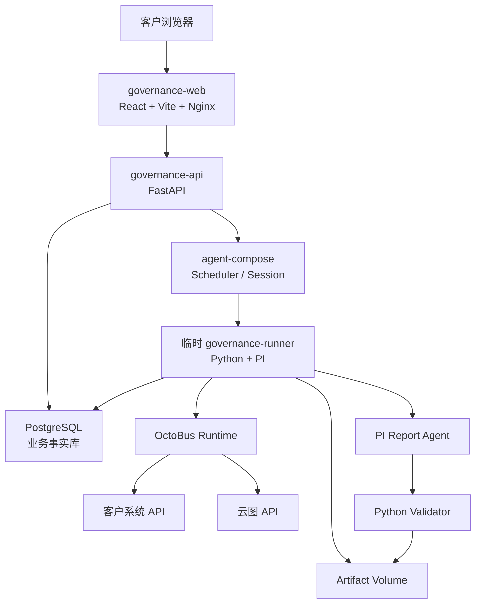
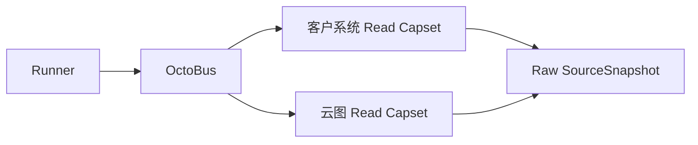
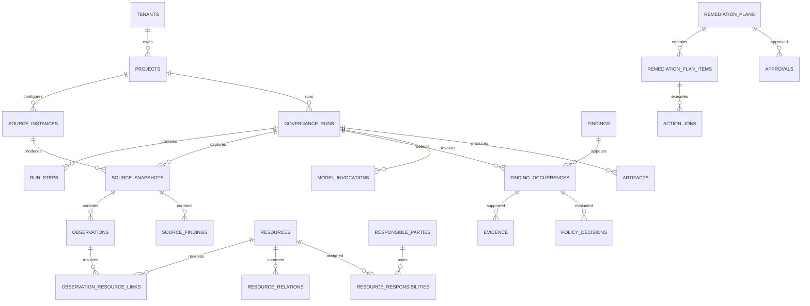

# 暴露面资产与风险治理平台：功能架构与数据流转架构 v0.1

状态：已确认的架构基线  
日期：2026-07-19  
适用范围：单客户、单实例、私有化部署的商业版第一期

## 1. 产品定位

商业版不是“让 Agent 自由读取文件并完成全部工作的 IP/端口对账工具”，而是：

> 面向多源资产数据的资产一致性治理与风险发现处置平台。

产品包含两条业务主线：

```text
资产治理：
多源事实 → 实体识别 → 属性/关系对比 → Finding → 确认与修正

风险治理：
云图风险判断 + 统一资产事实 → 风险归一/补充 → Finding
→ 审核 → 处置 → 复测 → 关闭
```

IP 和端口是第一批核心资产字段，但不是系统唯一的数据模型。首期同时支持 URL、域名、应用、部门和责任人，并允许通过受控 JSONB 字段扩展客户属性。

## 2. 已确认的关键决策

| 主题 | v0.1 决策 |
|---|---|
| 部署形态 | 单客户、单实例、Docker Compose 私有化部署 |
| 应用基座 | 固定 `full-stack-fastapi-template@4d3d5e9`，一次性引入并独立维护 |
| 调度与执行 | agent-compose 负责 Cron、手动/API 触发、Session 隔离与运行历史 |
| 业务事实 | PostgreSQL 是唯一权威结构化事实库 |
| 临时执行 | 每个 Governance Run 启动一个临时 Python Runner |
| 外部能力 | 客户系统和云图统一通过 OctoBus Service Package/Instance/Capset 接入 |
| 数据语言 | Python 为 API、确定性处理和规则主语言；SQL/Polars 承担重计算 |
| 前端与 Agent | React/TypeScript；PI Agent Kit 使用 TypeScript |
| Agent 编排 | v0.1 使用单个受限 PI；pi-workflow 先做 PoC，不进入关键路径 |
| 大文件 | 本地持久化 Artifact Volume；PostgreSQL 只保存元数据、路径和 Hash |
| 消息与队列 | 不引入 Redis、Celery、Kafka、Temporal 和通用 Outbox |
| 规则扩展 | 普通 Python 函数；不建设 DSL、插件框架或可视化规则编辑器 |
| 监控 | 结构化日志、健康检查、业务状态页、审计表和可选 OpenMetrics |

应用基座只提供认证、用户、API/Web 工程骨架、OpenAPI 客户端和测试基础设施，不承担 Governance Run、治理数据模型、调度或外部系统接入。详细边界见
[ADR-0001](../adr/0001-use-full-stack-fastapi-template.md)。

## 3. 功能架构

```text
治理平台
├─ 项目与数据源
├─ Run 中心
├─ 统一资产视图
├─ Finding 治理中心
│  ├─ 资产类 Finding
│  └─ 风险类 Finding
├─ 报告中心
├─ 处置与审批
└─ 系统与审计
```

### 3.1 项目与数据源

- 管理项目及客户系统数据源；
- 绑定 OctoBus Service、Instance 和只读 Capset；
- 测试连接并预览来源 Schema；
- 配置字段映射、启停状态和同步周期；
- 查看最近同步时间、记录数和错误摘要。

### 3.2 Run 中心

- 创建手动 Run；
- 查看定时 Run；
- 展示当前步骤、耗时和失败原因；
- 使用同一个业务 Run ID 恢复失败任务；
- 查看关联的 agent-compose Session；
- 下载本轮原始快照、报告和导出产物。

### 3.3 统一资产视图

- 查看 IP、Endpoint、Domain、URL、Application；
- 查看资产的来源观测；
- 查看资产间关系；
- 查看部门、责任人及责任关系；
- 对来源冲突和低置信度实体匹配进行人工确认。

### 3.4 Finding 治理中心

资产类首期覆盖：

```text
未报备资产
未观测资产
IP/端口差异
URL 差异
部门不一致
责任人不一致
责任人缺失
状态冲突
关系冲突
数据过期
```

风险类首期覆盖：

```text
云图高危端口
云图高危应用
云图管理后台
测试或默认页面暴露
违规公网暴露
```

风险详情必须同时展示：

- 云图原始判断；
- 治理系统归一结果；
- 严重性；
- 置信度；
- Evidence；
- 责任主体；
- 推荐动作；
- 当前处置状态。

### 3.5 报告中心

- 确定性统计；
- Agent 生成的客户说明；
- HTML、PDF 和 CSV 导出；
- 报告版本、输入快照、模型调用和 Artifact Hash 追溯；
- Agent 失败时提供确定性模板报告。

### 3.6 处置与审批

- 根据已确认 Finding 生成处置 Plan；
- 展示固定 `plan_hash`；
- 审批或拒绝；
- 通过 OctoBus Action Capset 执行；
- 查询外部任务状态；
- 复测并关闭 Finding。

### 3.7 系统与审计

- 管理用户和项目角色；
- 管理数据源和 Policy 版本；
- 查看操作审计；
- 查看系统健康和失败任务；
- 管理 Artifact 保留策略。

## 4. 总体运行架构



### 4.1 常驻服务

| 服务 | 技术 | 职责 |
|---|---|---|
| `governance-web` | React、TypeScript、Vite、Nginx | 客户界面和反向代理 |
| `governance-api` | Python、FastAPI、Pydantic | 项目、Run、资产、Finding、报告、审批 API |
| `postgres` | PostgreSQL | 业务状态、事实、治理结果、审计 |
| `octobus` | OctoBus Runtime | 外部系统能力网关 |
| `agent-compose` | agent-compose daemon | 定时、触发、隔离、Session 和运行日志 |

`governance-web` 和 `governance-api` 从固定版本的
[`full-stack-fastapi-template`](https://github.com/fastapi/full-stack-fastapi-template/tree/4d3d5e92c1ea6b3fa0fab02c41124844ec45bca8)
开始实现。模板的一次性导入、清理、认证、数据访问和 Nginx 边界统一以
[ADR-0001](../adr/0001-use-full-stack-fastapi-template.md) 为准，避免在架构文档重复维护清单。

### 4.2 临时 Runner

`governance-runner` 由 agent-compose 为每个业务 Run 创建，完成后退出。镜像包含：

```text
Python 业务代码
PostgreSQL Client
OctoBus Connect Client
Polars / PyArrow
PI Runtime
可选的 pi-workflow PoC
```

Runner 直接调用 OctoBus Connect HTTP 接口，不增加额外 Connector 代理服务。API 和 Runner 共享同一套 Python 领域代码与数据库访问代码。

### 4.3 组件边界

```text
agent-compose
  负责：什么时候运行、在哪里运行、运行日志和 Session 生命周期

PostgreSQL
  负责：业务执行到了什么状态、哪些事实和 Finding 已经成立

OctoBus
  负责：可以调用哪些外部系统能力

PI
  负责：基于受控 Evidence 生成结构化报告草稿
```

agent-compose 的 Run 成功不等于业务 Run 完成；客户业务状态始终以 PostgreSQL 为准。

## 5. 客户 API 接入流程

客户提供 API 文档后，不让 Agent 在生产运行时临时理解文档并直接调用接口。

```text
客户 API 文档
→ 集成工程师分析认证、分页、限流和字段
→ 开发或复用 OctoBus Service Package
→ 契约测试
→ 导入 OctoBus
→ 创建客户 Instance
→ 配置 Credential
→ 分配只读 Capset
→ 试拉取
→ 字段映射验收
→ 正式启用
```

对象关系：

```text
Service Package
  某一类系统的 API 对接实现，可复用

Instance
  某个客户环境的 URL、配置和凭据

Capset
  本平台获准使用的能力集合

Source Instance
  业务数据库中对 OctoBus Instance 的引用
```

Agent 可以协助生成 Service Package 草稿，但草稿必须经过代码审查、契约测试和人工启用。

## 6. 端到端数据流

### 6.1 Run 触发

```text
Cron / 手动 / API
→ agent-compose Scheduler
→ 创建 Governance Runner Session
→ Runner 创建或恢复 governance_run
```

触发输入至少包含：

```json
{
  "project_id": "project_bj_mobile",
  "trigger_id": "daily_20260720",
  "trigger_type": "schedule",
  "requested_by": "system"
}
```

`project_id + trigger_id` 用于防止同一次计划重复创建业务 Run。

### 6.2 数据拉取



要求：

- 使用分页和游标；
- 每页原始响应立即写入 Artifact；
- 记录 Schema 版本、记录数、游标和 SHA-256；
- 不把完整 API 响应一次性放入内存；
- 原始快照创建后不可覆盖。

### 6.3 三层事实

```text
Raw SourceSnapshot
→ Source Observation
→ Canonical Resource View
```

1. `SourceSnapshot` 保存来源批次和原始 Artifact；
2. `Observation` 保存规范化但仍带来源的事实；
3. `Resource` 保存经过实体识别后的统一资产视图。

不同来源的字段不能直接相互覆盖。例如客户系统和云图责任人不一致时，两条 Observation 都必须保留。

### 6.4 资产与责任主体

技术资产和责任主体分开：

```text
Technical Resource
  IP / Endpoint / Domain / URL / Application

Responsible Party
  Department / Person

Resource Responsibility
  owned_by / managed_by / operated_by
```

资源之间通过关系连接：

```text
Domain resolves_to IP
URL hosted_on Endpoint
URL belongs_to Application
Application exposed_by URL
```

### 6.5 Finding 生成

确定性处理只需要三个普通步骤：

```text
数据清洗
→ 判断是否为同一个资产
→ 执行资产检查与风险检查
```

建议代码组织：

```text
domain/
├─ normalization.py
├─ resolution.py
├─ asset_checks.py
├─ risk_checks.py
└─ findings.py

policies/
└─ dangerous_ports.json
```

不建设通用规则引擎、DSL、插件加载系统或可视化规则编辑器。

### 6.6 云图风险归一

云图已经具备高危端口、高危应用和管理后台等风险判断能力。系统必须保留原始来源判断：

```text
CloudAtlas SourceFinding
→ 风险归一与责任补充
→ Governance Finding
```

治理系统可以：

- 统一 Finding 类型；
- 关联 Canonical Resource；
- 补充责任部门和责任人；
- 结合 Policy 产生推荐动作；
- 根据额外证据调整治理置信度。

治理系统不能覆盖或删除云图原始判断。

### 6.7 报告生成

```text
Finding / Evidence
→ 有界 EvidenceBundle
→ PI StructuredReport Draft
→ Python Validator
→ Renderer
→ HTML / PDF / CSV
```

Agent 不读取全量 CSV、Parquet 或数据库，只通过受控工具查询有界数据。

### 6.8 处置

治理 Run 与处置 Run 分成不同 agent-compose Session：

```text
Governance Session 完成
→ 人工审核
→ 创建 RemediationPlan
→ 审批固定 plan_hash
→ 新建 Action Session
→ OctoBus Apply
→ 查询状态
→ 复测
→ 关闭或重新打开 Finding
```

等待人工审批时不保持 Runner Session 空转。

## 7. 业务 Run 与失败恢复

### 7.1 Session 粒度

```text
一个 Governance Run
= 一个 agent-compose Governance Session

一个已批准的处置计划
= 一个独立 agent-compose Action Session
```

不为每个小步骤创建单独 Session。

### 7.2 Run 步骤

```text
PULL_CUSTOMER
→ PULL_CLOUDATLAS
→ NORMALIZE
→ RESOLVE
→ CHECK_FINDINGS
→ BUILD_REPORT
→ VALIDATE_REPORT
→ COMPLETE
```

每个 `run_step` 保存：

- 状态；
- 尝试次数；
- `input_hash`；
- `output_hash`；
- 开始和完成时间；
- 错误摘要。

重新启动 Session 时使用同一个 `governance_run_id`，跳过输入未变化且已经成功的步骤。

### 7.3 发布规则

项目保存：

```text
projects.latest_completed_run_id
```

Runner 可以分步骤写入本轮数据，但客户默认页面只读取最新完整 Run。新 Run 完成时在事务中更新该指针。

### 7.4 失败分类

| 失败位置 | 结果 |
|---|---|
| 客户 API 或云图拉取 | `FAILED_DATA`，不发布本轮 |
| 标准化、匹配或 Finding 检查 | `FAILED_PROCESSING`，不发布本轮 |
| PI 或 pi-workflow | 生成模板报告，`COMPLETED_WITH_WARNINGS` |
| OctoBus 处置 | 只影响 `ActionJob`，不修改事实 Run |

## 8. PostgreSQL 数据模型

所有业务表默认包含：

```text
id UUID
tenant_id UUID
created_at TIMESTAMPTZ
updated_at TIMESTAMPTZ
```

v0.1 单实例单租户，但保留 `tenant_id`。

### 8.1 核心 ER



### 8.2 表分组

```text
项目与运行
├─ tenants
├─ projects
├─ source_instances
├─ governance_runs
└─ run_steps

来源事实
├─ source_snapshots
├─ observations
└─ source_findings

统一资产
├─ resources
├─ observation_resource_links
├─ resource_relations
├─ responsible_parties
└─ resource_responsibilities

治理结果
├─ findings
├─ finding_occurrences
├─ evidence
└─ policy_decisions

Agent 与产物
├─ model_invocations
└─ artifacts

处置
├─ remediation_plans
├─ remediation_plan_items
├─ approvals
└─ action_jobs

审计
└─ audit_events
```

### 8.3 Finding 生命周期

`Finding` 和 `FindingOccurrence` 分开：

```text
Finding
  跨 Run 持续存在的治理问题

FindingOccurrence
  某次 Run 再次发现该问题
```

`findings` 使用稳定 `dedupe_key`，保存首次发现、最后发现和当前状态；每次运行写入对应的 `finding_occurrence`。

### 8.4 核心唯一约束

```text
UNIQUE(project_id, trigger_key)
UNIQUE(run_id, step_code)
UNIQUE(snapshot_id, source_record_key)
UNIQUE(project_id, resource_type, canonical_key)
UNIQUE(project_id, dedupe_key)
UNIQUE(finding_id, run_id)
UNIQUE(action_jobs.idempotency_key)
```

IP 字段原则上使用 PostgreSQL `inet`。v0.1 的 `AuditEvent.ip_address` 是显式例外：按 [#26](https://github.com/Notyet1307/Exposure-Agent/issues/26) 保留 `varchar(45)`。当前受支持的 HTTP 审计写入仅持久化经共享请求地址解析器验证的单个 IPv4 或 IPv6 地址；可信入口按部署边界提供 `X-Real-IP`，解析器不解析或保存原始 `X-Forwarded-For` 代理链。只有在出现绕过应用解析器的受支持写入方、已持久化异常数据、数据库级 IP/网段查询或索引需求，或客户/安全基线明确要求原生网络类型且生产及备份数据盘点条件已经具备时，才重新评估 `inet` 迁移。高频且需要索引的其他字段使用类型化列，客户扩展字段使用受 Schema 管理的 JSONB。

## 9. Agent 架构

### 9.1 定位

PI 是“基于确定性 Evidence 生成客户可读报告的编译器”，不是资产匹配引擎、风险扫描器或处置执行器。

### 9.2 v0.1 工具

```text
get_run_summary(run_id)

list_findings(
  run_id,
  domain,
  finding_type,
  severity,
  confidence,
  cursor,
  limit <= 50
)

get_finding(finding_id)

submit_report_draft(run_id, structured_report)
```

`get_finding` 返回已经确定的资源、来源判断、严重性、置信度、Evidence、PolicyDecision 和推荐动作。

### 9.3 Agent 权限

Agent 不拥有：

- PostgreSQL 凭据；
- 完整业务文件读取；
- OctoBus Capset；
- Finding 修改能力；
- 处置能力；
- 自由 Shell。

Runner 启动 PI 子进程时必须过滤环境变量，不把数据库连接串、OctoBus Credential 或 Action Capset 传给 PI。Agent 工具通过 Run 级只读 Token 查询有界 Evidence API；该 Token 在 Session 结束后失效。

### 9.4 输出与校验

模型先输出结构化 Draft。Validator 至少检查：

- Finding ID 和 Evidence ID 是否存在；
- 数字与确定性统计是否一致；
- 严重性、置信度和推荐动作是否被改变；
- 是否把“本轮未观测”写成“已经关闭”；
- 是否出现无 Evidence 的新风险判断。

失败时最多进行一次结构化修复，仍失败则使用模板报告。

### 9.5 pi-workflow

`pi-workflow` 可以作为 PI 内部：

```text
Evidence → 分析 → 独立验证 → Structured Report
```

的工作流引擎，但 v0.1 先运行单 PI 基线。只有兼容性 PoC 和 Golden Dataset 证明多阶段工作流显著改善 32B 模型质量后，才加入正式路径。

`pi-workflow` 的本地 Run 不替代业务 Run。

## 10. 技术栈

### 10.1 Python

```text
FastAPI       API
Pydantic      契约和校验
SQLAlchemy    数据访问
Alembic       数据库迁移
psycopg       PostgreSQL Driver
Polars        批量数据处理
PyArrow       Arrow / Parquet
pytest        测试
```

### 10.2 TypeScript

```text
React + Vite             客户 Web
PI Agent Kit             Agent 工具和 Prompt
pi-workflow JSON/TS      可选 Agent 工作流
OctoBus Service Package  外部能力定义
```

### 10.3 语言边界

- 资产和风险确定性逻辑使用 Python；
- 集合查询、聚合和约束优先使用 SQL；
- 大批量内存计算使用 Polars/Arrow；
- Shell 只负责构建、启动和部署，不承载业务规则；
- 不在 v0.1 引入 Go、Java 或 Rust 服务。

模板现有认证和用户模型使用 SQLModel。首期保留这套实现，并与现有 SQLAlchemy Engine、Session、Metadata 和 Alembic 环境共同管理；只有实际业务模型遇到可复现的 SQLModel 限制时，才另立 ADR 评估迁移。

出现经过测量的热点后，先优化 SQL、索引、批处理和 Polars，再决定是否重写局部组件。

## 11. 大数据量设计

### 11.1 数据处理

```text
OctoBus 分页结果
→ 每页立即写入 Artifact
→ 分批标准化
→ PostgreSQL COPY 到临时表
→ SQL / Polars 集合计算
→ 批量写入正式表
```

禁止：

- 全量 API 响应一次性载入内存；
- Pandas `iterrows()`；
- 逐行数据库插入；
- 每个观测端口扫描全部报备记录；
- 将完整 Finding 明细传给模型。

### 11.2 匹配

```text
IP / Domain / URL
→ 规范化 Canonical Key
→ Hash 和索引匹配

Endpoint
→ 按 IP + Protocol 分组
→ 端口区间排序和合并
→ 双指针匹配

部门 / 责任人
→ 外部编码优先
→ 名称映射为候选
→ 模糊匹配只生成待确认项
```

### 11.3 首期索引

```text
(project_id, resource_type, canonical_key)
(run_id, snapshot_id)
(snapshot_id, source_record_key)
(ip, protocol, port)
(run_id, finding_type, severity)
(project_id, dedupe_key)
```

首期不做表分区；普通索引和批量写入出现实测瓶颈后，再按 Run 或时间分区。

### 11.4 性能测试矩阵

| 数据量 | 用途 |
|---:|---|
| 10,000 条 | 开发回归 |
| 100,000 条 | 标准交付验收 |
| 1,000,000 条 | 压力和内存上限 |

硬性要求：

- LLM 上下文不随业务数据线性增长；
- Runner 内存峰值受批大小控制；
- 重试不重新拉取已经成功且 Hash 未变化的快照；
- 匹配算法不能退化为 `O(R × E)`。

## 12. 权限与安全

### 12.1 人员角色

| 角色 | 主要权限 |
|---|---|
| Viewer | 查看资产、Finding 和报告 |
| Operator | 创建 Run、确认 Finding、创建 Plan |
| Approver | 审批或拒绝固定 Plan |
| Admin | 全局管理数据源、用户、项目、成员角色和 Policy；复用模板 `is_superuser` |

Viewer、Operator 和 Approver 通过 `ProjectMembership` 按项目授权。Admin 是全局身份，不写入 `ProjectMembership`。

### 12.2 系统身份

```text
governance-runner
  PostgreSQL 业务写权限 + OctoBus Read Capset

report-agent
  Run 级只读 Evidence Token，无数据库和 OctoBus 权限

action-runner
  读取已批准 Plan + OctoBus Action Capset
```

### 12.3 审批不变量

```text
plan_creator != approver          高风险动作
approval.plan_hash == current_plan.plan_hash
approval 未过期
ActionJob.idempotency_key 唯一
```

计划变化后旧审批自动失效。

### 12.4 网络和容器边界

只对客户网络开放 HTTPS 443。PostgreSQL、OctoBus、Runner、PI Runtime 和 Docker API 不对外暴露。

Runner：

- 默认非 root；
- 不挂载 Docker Socket；
- 每次 Run 使用独立工作目录；
- 完成归档后销毁临时 Workspace。

agent-compose 是唯一可以创建 Runner 的组件。如果它必须访问容器运行时，应部署在产品专用服务器或 VM。

## 13. 可观测性与审计

### 13.1 日志字段

```text
timestamp
level
service
project_id
governance_run_id
run_step
agent_compose_session_id
source_snapshot_id
action_job_id
message
```

禁止在日志中记录凭据、完整模型上下文和完整客户原始数据。

### 13.2 健康检查

```text
/health/live
/health/ready
```

Docker Compose 使用这些接口判断服务状态。

### 13.3 审计

`audit_events` 至少记录：

```text
actor_subject
actor_type
action
project_id
target_type
target_id
before_data JSONB
after_data JSONB
ip_address
occurred_at
```

数据源变更、Run 启动/重试、人工确认、Plan 变更、审批、Apply、Policy 变更、角色变更和 Artifact 下载必须审计。

### 13.4 指标

应用暴露可选 OpenMetrics `/metrics`：

- Run 数量、耗时和失败率；
- Step 耗时；
- 拉取记录数；
- Finding 分类数量；
- Agent 调用耗时和模板回退次数；
- ActionJob 成功和失败数量。

v0.1 不捆绑 Prometheus、Grafana 或 ELK。

## 14. 部署与持久化

### 14.1 Docker Compose 服务

```text
governance-web
governance-api
postgres
octobus
agent-compose
```

Runner 由 agent-compose 动态创建，不作为常驻 Compose 服务。

### 14.2 持久化卷

```text
postgres-data
artifacts
octobus-data
agent-compose-data
```

正式备份必须覆盖 PostgreSQL、Artifact Volume、OctoBus 配置和部署版本清单。

### 14.3 离线交付包

```text
Docker 镜像
docker-compose.yml
环境变量模板
数据库迁移
初始化和健康检查脚本
版本清单
SHA-256
备份和恢复脚本
```

v0.1 不提供 Helm Chart、跨节点高可用或自动扩缩容。

## 15. 产品级不变量

1. 相同输入快照、处理版本和 Policy 版本产生相同确定性 Finding；
2. 原始 SourceSnapshot、Observation 和 SourceFinding 不可被覆盖；
3. 云图原始风险判断可追溯；
4. 每个用户可见结论都能追溯到 Finding 和 Evidence；
5. Agent 不计算权威统计，也不能修改 Finding；
6. Agent 失败不阻断确定性结果和模板报告；
7. 客户默认只看到最新完整 Run；
8. 失败重试不重复创建 Finding，也不重复执行外部动作；
9. 报告 Agent 永远没有真实写权限；
10. 所有真实动作绑定 Plan Hash、审批身份、有效期和幂等键；
11. agent-compose Session 不是业务事实源；
12. 数据量增长不导致 LLM 上下文线性增长。

## 16. v0.1 非目标

```text
多租户 SaaS
Kubernetes 高可用
Redis / Celery / Kafka / Temporal
MinIO 或独立对象存储服务
Elasticsearch
向量数据库
图数据库
通用 Agent 聊天
多 Agent 默认路径
可视化工作流编辑器
低代码规则 DSL
自助生成生产 Connector
客户自行编写 Connector
自定义仪表盘设计器
```

## 17. 尚需在实施前确定

以下内容依赖真实客户环境，不能在架构阶段臆定：

- 客户系统 API 的认证、分页、限流和增量能力；
- 云图与客户系统的实际数据规模；
- 交付服务器 CPU、内存、磁盘和网络规格；
- 客户身份源及登录集成方式；
- Artifact 和审计数据保留周期；
- agent-compose 商业交付版本的生产硬化项；
- 客户对备份恢复时间和数据恢复点的要求。

## 18. 推荐实施顺序

以下顺序只表示依赖关系，不代表第 3 步及之后已经达到 agent-ready。每个业务阶段仍需经过调查或针对性 grilling，再进入 `/to-spec`、`/to-tickets` 和 factory。

```text
1. 固定版本模板基线导入并证明上游检查可运行
2. 模板清理与私有化控制面收敛
3. Project + ProjectMembership 三个项目角色 + AuditEvent
4. PostgreSQL 治理领域迁移骨架
5. Governance Run + agent-compose Runner
6. OctoBus 双来源拉取 + SourceSnapshot
7. Observation + Resource Resolution
8. 资产检查 + 云图 SourceFinding 归一
9. Finding 生命周期 + Evidence
10. 客户 Web 的 Run/资产/Finding 页面
11. 单 PI StructuredReport + Validator
12. Plan / Approval / ActionJob
13. 10k / 100k / 1m 性能与故障恢复验收
14. pi-workflow 兼容性和质量 PoC
15. 离线交付与备份恢复验收
```
